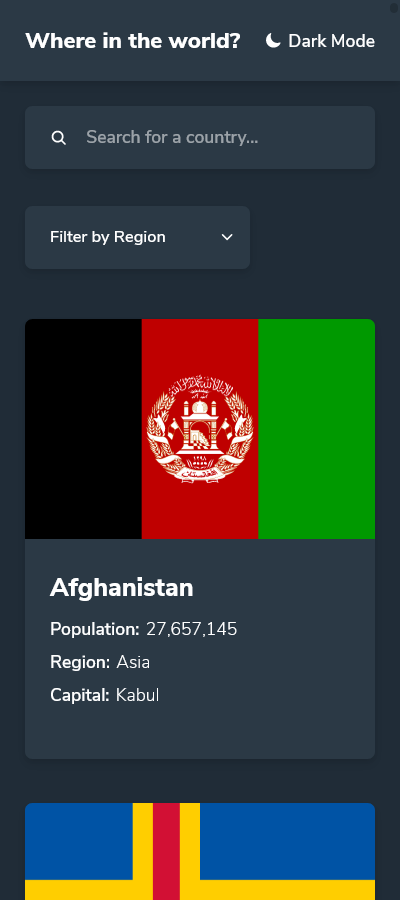
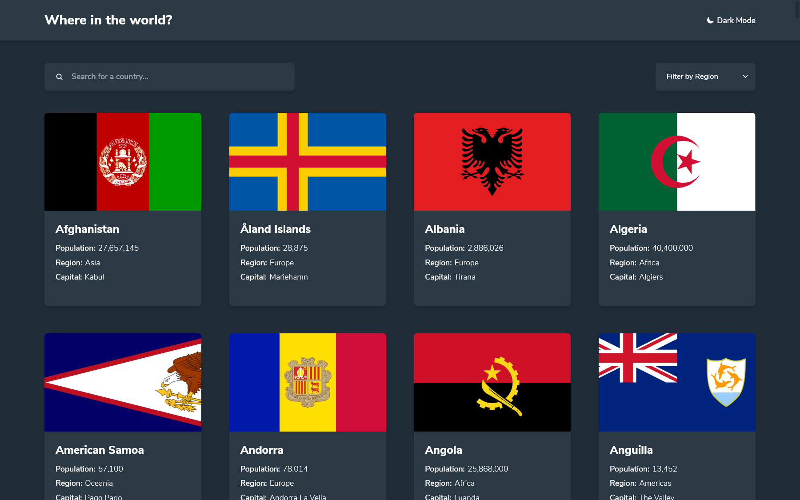

# Frontend Mentor - REST Countries API with color theme switcher solution

This is a solution to the [REST Countries API with color theme switcher challenge on Frontend Mentor](https://www.frontendmentor.io/challenges/rest-countries-api-with-color-theme-switcher-5cacc469fec04111f7b848ca). Frontend Mentor challenges help you improve your coding skills by building realistic projects. 

## Table of contents

- [Overview](#overview)
  - [The challenge](#the-challenge)
  - [Screenshot](#screenshot)
  - [Links](#links)
- [My process](#my-process)
  - [Built with](#built-with)
  - [What I learned](#what-i-learned)
  - [Continued development](#continued-development)
- [Author](#author)

**Note: Delete this note and update the table of contents based on what sections you keep.**

## Overview

### The challenge

Users should be able to:

- See all countries from the API on the homepage
- Search for a country using an `input` field
- Filter countries by region
- Click on a country to see more detailed information on a separate page
- Click through to the border countries on the detail page
- Toggle the color scheme between light and dark mode *(optional)*

### Screenshot

### Links

- [Solution URL](https://github.com/ihollarmide/frontendmentor-rest-api-countries)
- [Live Site URL](https://idris-rest-api-countries.netlify.app/countries)

## My process

### Built with

- Semantic HTML5 markup
- Flexbox
- CSS Grid
- [React](https://reactjs.org/) - JS library
- [Axios](https://axios-http.com/) - Promise based HTTP client for the browser and node.js
- [Styled Components](https://styled-components.com/) - For styles

### What I learned

- I learnt how to to consume data from an API using axios

### Continued development

I intend to use animations in my next project.

## Author

- Frontend Mentor - [@ihollarmide](https://www.frontendmentor.io/profile/ihollarmide)
- Twitter - [@i_hollarmide](https://www.twitter.com/i_hollarmide)
